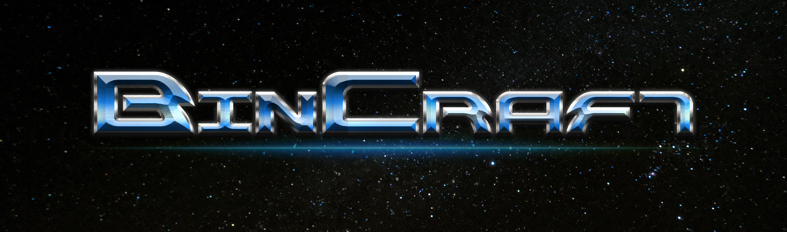
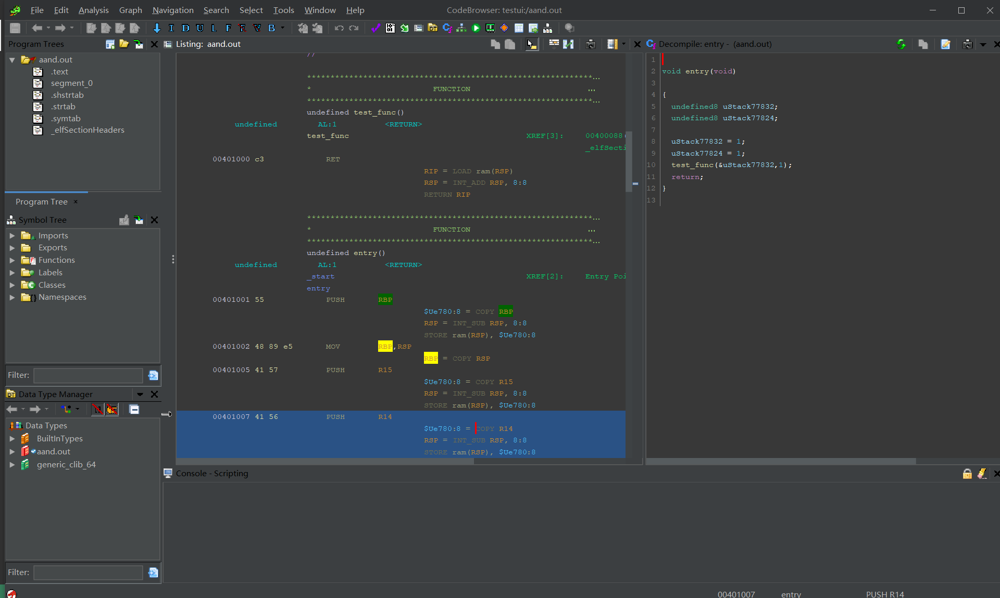

# BinCraft - Binary Analysis Craft

BinCraft is the future binary analysis tool based on Ghidra, or a Ghidra release version.

Features:

- Modernized UI (Dark Theme)
- More aggressive bug fixes and features
- Out of the box Ghidra, useful extensions included
- Useful tools based on Ghidra
- Ghidra original power included

NOTE: Current under active development.

UI preview:



## Why?

[Ghidra](https://github.com/NationalSecurityAgency/ghidra) is a nice project.
But it is huge already.
The maintainance is hard and although they are trying their best to advance it, the procedure is still quite slow.
Many PRs are given in early 2019 but remains no reply, and they might be useful to people.

Thus, we decide to maintain a faster Ghidra.
Our thought is to maintain a Ghidra release, which will still trace upstream ghidra fixes but modify the code in our way to modernize some of the parts.

For quite a long time, we will not maintain a "forked" Ghidra (means that we will still track upstream fixes and do not tend to modify the code structure).
Unless, the value of it is proved.

## Organize

Each functionality is called a "craft", currently we are planning crafts like:

- SleighCraft: A Rust crate with Python/NodeJs (and maybe more!) bindings that export Ghidra Sleigh Engine to disassemble binary and lift them to Pcode IR
- GhidraCraft: A collection of bincraft-maintained Ghidra extensions that may make your life easier when using Ghidra

### SleighCraft

`SleighCraft` is a decoder (or, linear disassembler) based on ghidra's decompiler implementation. Sleighcraft can be used in Rust or Python, with both high-level and low-level API.

In general, `sleighcraft` is just like [capstone](https://www.capstone-engine.org/) but with IR and more archs.

Features:

- Rust based API and Python scripting API.
- Decoding with IR as the semantic meaning.
- Archs: **110** architectures.

️️✔️: provided

❌: not provided

🚧: in construction

🤔: not sure, maybe not

Comparison with capstone:

|Feature|SleighCraft| Capstone Engine |
|-------|----------|----------|
|disassemble| ✔️ |  ✔️ | 
|IR|✔️️|❌|
|C API|🚧|✔️|
|custom architecture|️✔️|❌|

Architectures comparision with capstone (according to [capstone arch list](https://www.capstone-engine.org/arch.html)):

|Arch Names|SleighCraft| Capstone Engine |
|----------|-----------|-----------------|
|6502|✔️|🤔|
|6805|✔️|🤔|
|8051|✔️|🤔|
|8048|✔️|🤔|
|8085|✔️|🤔|
|68000|✔️|🤔|
|aarch64(armv8)|✔️|️️✔️|
|arm|✔️|️️✔️|
|cp1600|✔️|🤔|
|cr16|✔️|🤔|
|avr8|✔️|️️🤔|
|dalvik|✔️|🤔|
|jvm|✔️|🤔|
|mips|✔️|️️✔️|
|powerpc|✔️|️️✔️|
|sparc|✔️|️️✔️|
|tricore|✔️|🤔|
|riscv|✔️|🤔|
|z80|✔️|🤔|
|System Z|❌|✔️|
|xCore|❌|✔️|

#### How to install

Rust

Use cargo:

```toml
sleighcraft = { git = "https://github.com/StarCrossPortal/bincraft" }
```

The repo is a bit large to submit on crates-io (because of predefined sla files), but save you the complex of compiling sleigh files yourself.

Python:

```bash
# quick install it with pip
$ pip3 install bincraft

# or download binaries than choose the corresponding architecture
$ pip3 install bincraft-0.1.0-cp39-cp39-Arch.whl

# or manual, to do this, you need to have rust compiler installed and maturin
# better with rustup.
$ pip3 install maturin
$ maturin build
$ pip3 install bincraft-0.1.0-cp39-cp39-Arch.whl
```

NodeJs:

```bash
# quick install it with npm 
$ npm i bincraft

# or manual, to do this, you need to have rust compiler installed, nodejs and neon
# better with rustup.
$ npm install -g neon-cli
$ neon build
```

### How to Use

One could refer to doc.rs to see how Rust binding can be used.

Python binding:

```python
from bincraft import Sleigh

code = [0x90, 0x31, 0x32] # code to disassemble

# init the sleigh engine Sleigh(arch, code)
sleigh = Sleigh("x86", code)

# now we are prepared to disassemble!
# disasm(start_addr)
for asm in sleigh.disasm(0):
    addr = asm.addr()
    mnem = asm.mnemonic()
    body = asm.body()

    # quite like capstone, right?
    print(f'Addr: {addr}\t  mnemonic: {mnem}\t body: {body}')

    # but! we also have the IR!
    pcodes = asm.pcodes()
    for pcode in pcodes:
        opcode = pcode.opcode()
        vars = pcode.vars()
        print(f'opcode: {opcode}\t vars: {vars}\t')
    print()
```

Nodejs binding:

```js
const Sleigh = require('bincraft');
//or const Sleigh = require('.');

// init the sleigh engine Sleigh(arch, code) like python
const sleigh = new Sleigh("x86",[0x90,90]);

// disasm(start_addr) 
// - start: Default is 0
const asms = sleigh.disasm();

asms.forEach(asm => {
    let addr = asm.addr();
    let mnemonic = asm.mnemonic();
    let body = asm.body();
    // dump instruction
    console.log(`addr: ${addr}\t mnemonic: ${mnemonic}\t body: ${body}`);
    
    // And we have IR！
    let pcodes = asm.pcodes();
    pcodes.forEach(pcode => {
        opcode = pcode.opcode();
        vars = pcode.vars();
        
        console.log(`opcode: ${opcode}\t vars: ${vars}`);
    });
});

```

Rust (kinda low level):

```Rust
// Overall procedure:
// 1. get the spec, this is where we know how to decode anything
// 2. get a loader, this is where we fill the input bytes to the engine.
// A predefined loader is provided: `PlainLoadImage`, which sets
// the things to decode by using a single buf.
// 3. set the AssemblyEmit and PcodeEmit instance, these are two
// traits that defines the callback at the decode time.
// 4. do the decode
use sleighcraft::*;
let mut sleigh_builder = SleighBuilder::default();
let spec = arch("x86").unwrap();
let buf = [0x90, 0x32, 0x31];
let mut loader = PlainLoadImage::from_buf(&buf, 0);
sleigh_builder.loader(&mut loader);
sleigh_builder.spec(spec);
let mut asm_emit = CollectingAssemblyEmit::default();
let mut pcode_emit = CollectingPcodeEmit::default();
sleigh_builder.asm_emit(&mut asm_emit);
sleigh_builder.pcode_emit(&mut pcode_emit);
let mut sleigh = sleigh_builder.try_build().unwrap();

sleigh.decode(0).unwrap();

println!("{:?}", asm_emit.asms);
println!("{:?}", pcode_emit.pcode_asms);
```

A more detailed documentation of Rust API is still under development.

## About Us

This is a project started by [StarCrossTech](https://www.starcross.tech/#/) [PortalLab](https://github.com/StarCrossPortal).

Any contribution through pull request is welcome. ✌️